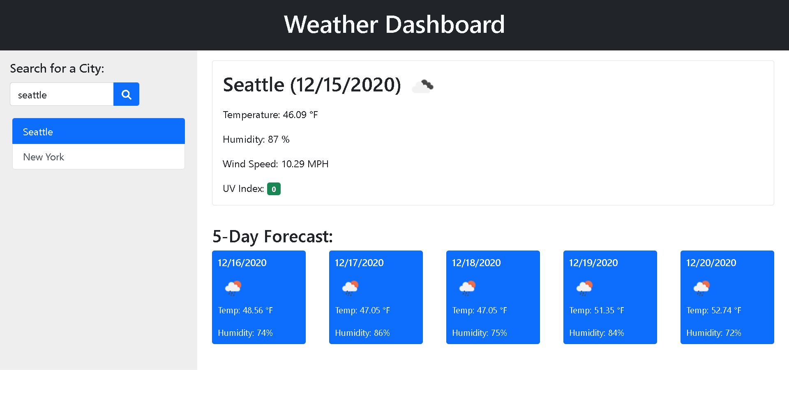

# Weather-Dashboard
Weather Dashboard is a web application designed to display weather condition of cities. When given a city name, Weather Dashboard will present user with the current weather condition, along with the 5-day forecast of that city.

## Screenshot

## Live URL
https://alex-fok.github.io/Weather-Dashboard/
